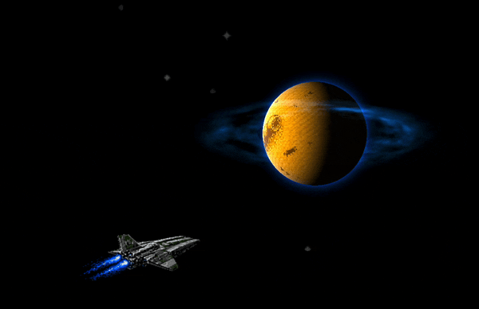

# ghostty-shaders



Two Ghostty custom fragment shaders that render a procedural 3D-rotating
Arrakis planet in the bottom-right corner of the terminal, over a starfield
with an animated ship sprite and an atmospheric halo/ring.

## Variants

- `dune2-game.glsl` - 16-bit Sega Mega Drive / Westwood Dune II pixel-art
  surface.
- `dune-movie.glsl` - Villeneuve-style photoreal desert surface.

Both embed a 256x128 equirectangular planet texture as 64-colour palette
indices (1 byte per pixel, packed 4 pixels per uint32). No external assets
are required; Ghostty only needs to expose its default `iChannel0`.

## Usage

1. Copy the variant you want into Ghostty's shader directory:

   ```
   cp dune2-game.glsl ~/.config/ghostty/shaders/dune.glsl
   ```

2. Reference it from `~/.config/ghostty/config`:

   ```
   custom-shader = shaders/dune.glsl
   ```

3. Reload the Ghostty config (Cmd+Shift+, on macOS) or restart Ghostty.

To switch variants, overwrite the same target file with the other shader
and reload.

## Tuning

Most visual parameters are compile-time constants at the top of each file:
`SPIN_SPEED`, `PLANET_W_FRAC`, `PLANET_H_FRAC`, `BG_BRIGHTNESS`,
`TEXT_LUM_LOW`, `TEXT_LUM_HIGH`. Edit in place and reload.
